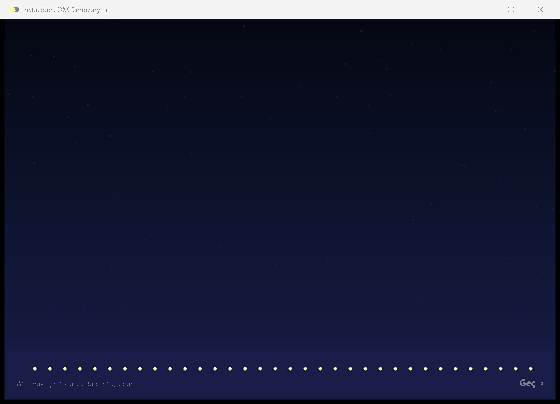
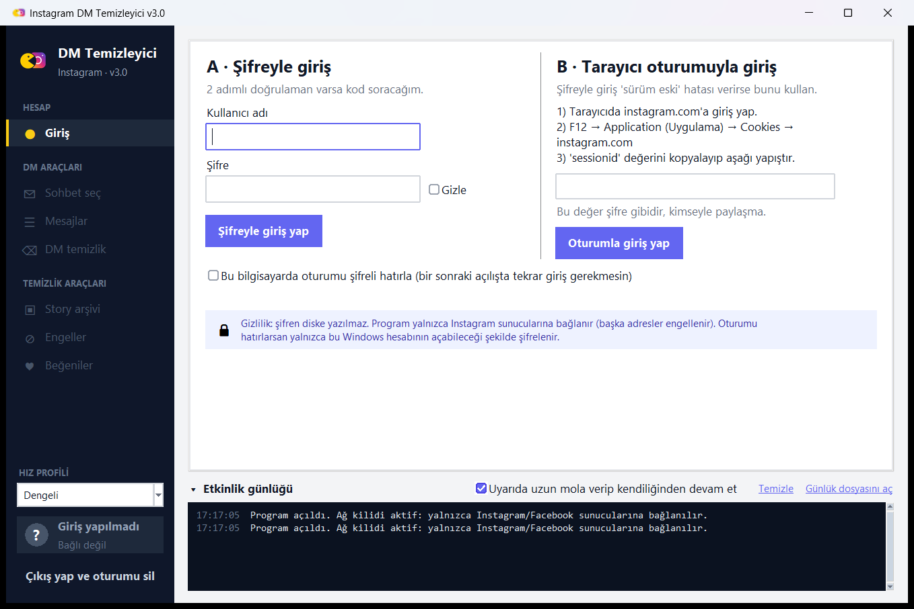
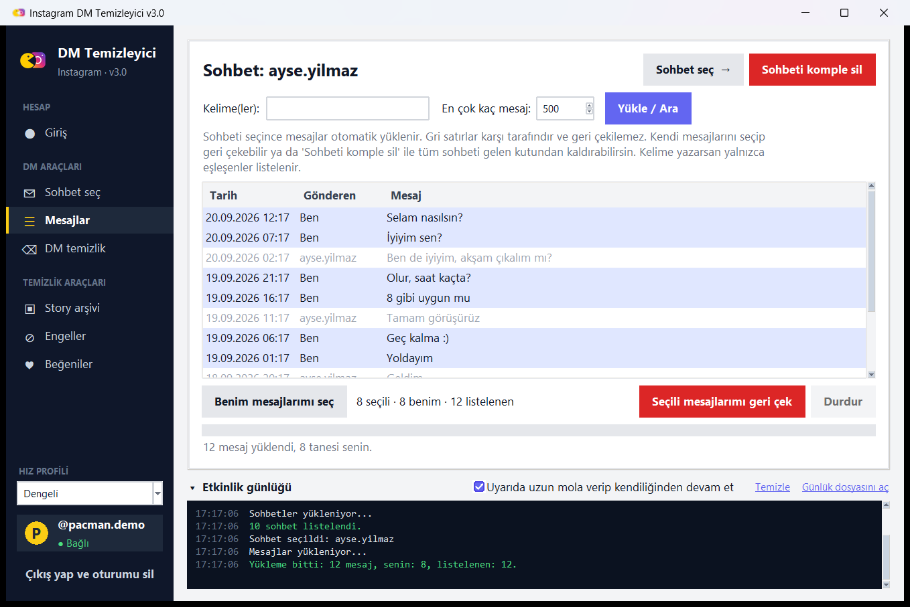
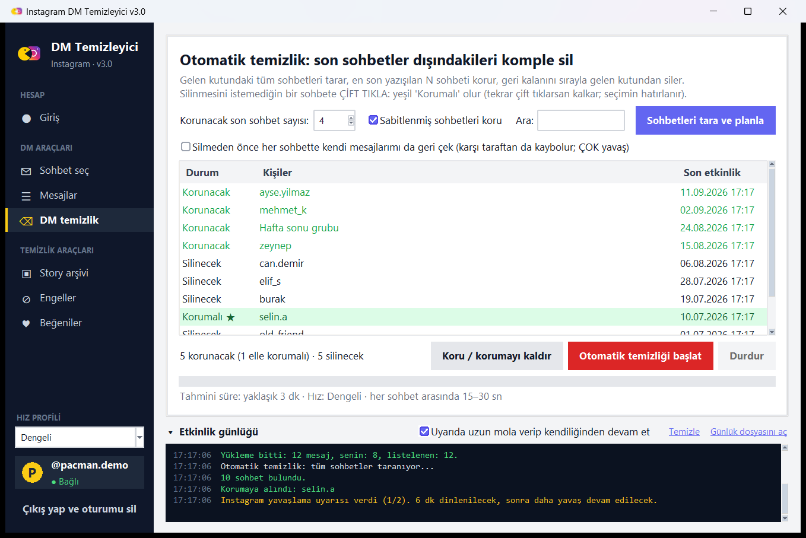
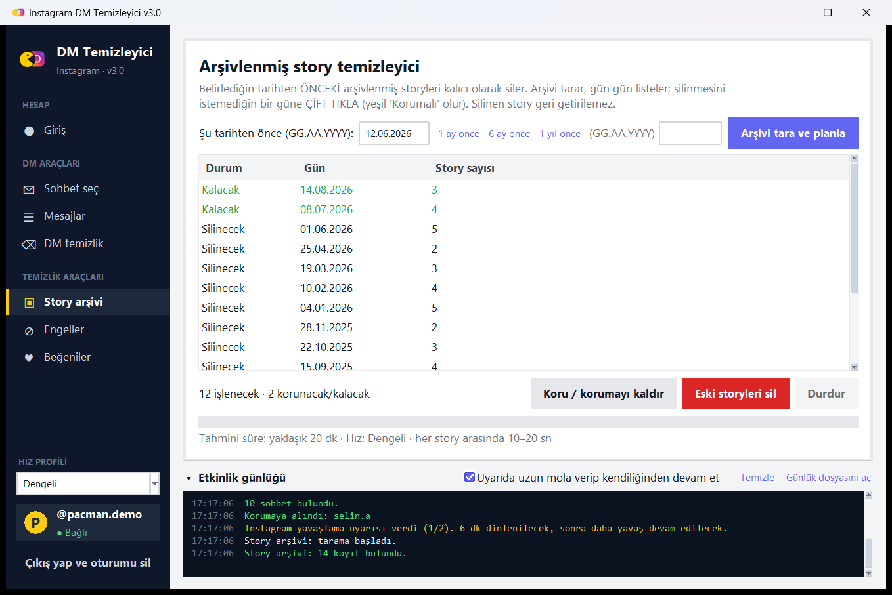
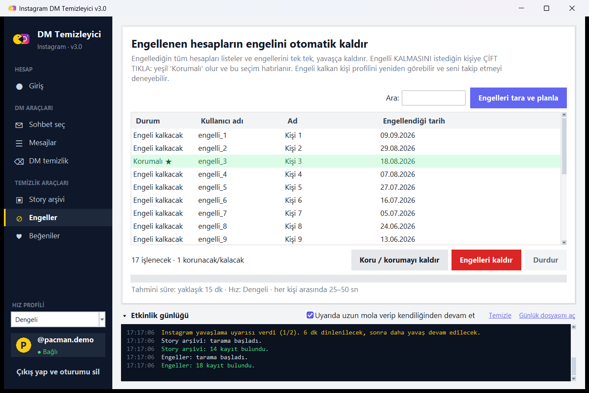
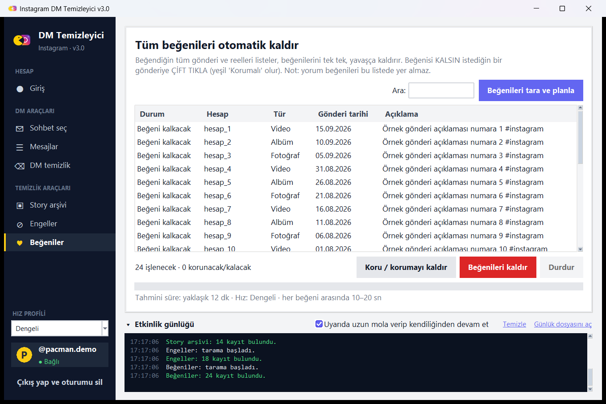
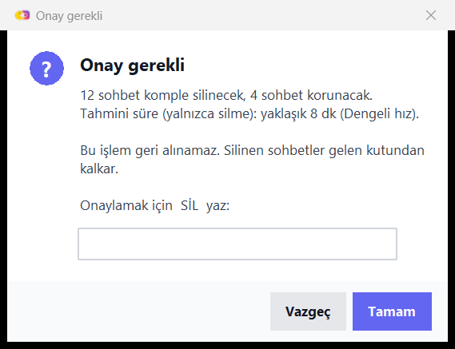

<div align="center">


# Instagram DM Temizleyici

**Pacman, Instagram'ı yesin.** DM, story arşivi, engel ve beğeni temizliğini yavaş, güvenli ve tamamen otonom yapan Windows aracı.

[](#-hızlı-başlangıç)
[](#-kaynaktan-çalıştırma)
[](LICENSE)
[](#-testler)
[](#-yapımcı)



</div>

---

## ✨ Ne yapar?

| | Araç | Açıklama |
|---|---|---|
| ✉️ | **DM sohbet temizliği** | Sohbetteki mesajlarını geri çeker (herkes için siler) ya da sohbeti komple gelen kutundan kaldırır. |
| 🤖 | **Otomatik DM temizliği** | Tüm gelen kutusunu tarar, **son N sohbeti korur** (varsayılan 20), kalanını sırayla siler. Sabitlenmiş sohbetler de korunabilir. |
| 🗂️ | **Story arşivi temizleyici** | Seçtiğin bir tarihten **önceki** arşivlenmiş storyleri siler. |
| ⛔ | **Engel kaldırıcı** | Engellediğin tüm hesapların engelini tek tek, otomatik kaldırır. |
| ♥ | **Beğeni temizleyici** | Beğendiğin tüm gönderi ve reellerin beğenisini kaldırır. |

Her araçta aynı akış vardır: **tara → planı gör → onayla → program kendi başına bitirir.**

- 🟢 Silinmesini istemediğin bir satıra **çift tıkla**: yeşil **Korumalı ★** olur ve program onu asla silmez (seçimin hatırlanır).
- 🐢 İşlemler **insan gibi yavaş** yapılır (rastgele bekleme + ara sıra dinlenme molası). Üç hız profili vardır.
- 🛡️ Instagram bir uyarı verirse program **kendiliğinden yavaşlar, dinlenir ve devam eder**; ciddi bir uyarıda hemen durur.
- 🔐 Şifren diske yazılmaz, program **yalnızca Instagram sunucularına** bağlanabilir.

## 🖼️ Ekran görüntüleri

<table>
<tr>
<td></td>
<td></td>
</tr>
<tr>
<td align="center"><sub>Giriş (şifre + 2 adımlı doğrulama ya da tarayıcı oturumu)</sub></td>
<td align="center"><sub>Sohbet mesajları — gri satırlar karşı tarafındır</sub></td>
</tr>
<tr>
<td></td>
<td></td>
</tr>
<tr>
<td align="center"><sub>Otomatik DM temizliği — yeşil satır: elle korunan sohbet</sub></td>
<td align="center"><sub>Story arşivi — tarihten öncekiler silinir</sub></td>
</tr>
<tr>
<td></td>
<td></td>
</tr>
<tr>
<td align="center"><sub>Engelleri kaldır</sub></td>
<td align="center"><sub>Beğenileri kaldır</sub></td>
</tr>
</table>

<p align="center"><br><sub>Geri alınamaz işlemler yazılı onay ister.</sub></p>

> Ekran görüntülerindeki tüm veriler örnektir (sahte istemci); gerçek bir hesap kullanılmamıştır.

## 🚀 Hızlı başlangıç

1. [**Releases**](../../releases/latest) sayfasından `IGDMTool.exe` dosyasını indir (Python gerekmez).
2. Çift tıkla. Açılış ekranından sonra **Giriş** sayfası gelir.
3. Giriş yöntemlerinden birini seç:

### A · Şifreyle giriş
Kullanıcı adı ve şifreni yaz (şifre **görünür** yazılır, istersen "Gizle"yi işaretle). 2 adımlı doğrulaman varsa program kodu sorar.

### B · Tarayıcı oturumuyla giriş (önerilir)
Instagram şifreyle girişte bazen *"Your version of Instagram is out of date"* hatası verir (özellikle 2 adımlı doğrulamalı hesaplarda). Bu, programın hatası değil; Instagram'ın taklit edilen mobil uygulama sürümünü reddetmesidir. Böyle olursa:

1. Tarayıcında instagram.com'a normal giriş yap (kodu orada gir).
2. `F12` → **Application (Uygulama)** → **Cookies** → `https://www.instagram.com`
3. `sessionid` değerini kopyala, programda **B** kutusuna yapıştır.

> ⚠️ `sessionid` bir şifre gibidir. Kimseyle paylaşma. Program onu diske yazmaz (istersen yalnızca şifreli olarak saklar).

Girişten sonra **tüm sayfalar** kullanılabilir.

## ⚙️ Hız profilleri ve güvenlik önlemleri

Sol alttaki **Hız profili** tüm araçlar için geçerlidir. Süreler her seferinde rastgeledir; belirli sayıda işlemden sonra ayrıca uzun bir mola verilir.

| Profil | Mesaj | Sohbet | Story | Engel | Beğeni |
|---|---|---|---|---|---|
| Güvenli | 60–120 sn | 30–60 sn | 20–40 sn | 45–90 sn | 20–40 sn |
| **Dengeli** *(varsayılan)* | 30–60 sn | 15–30 sn | 10–20 sn | 25–50 sn | 10–20 sn |
| Hızlı | 15–30 sn | 8–15 sn | 5–10 sn | 12–25 sn | 5–10 sn |

**Uyarı geldiğinde:**

- **Yumuşak uyarı** ("lütfen bekle", 429): 5–8 dk dinlenir, hızı %50 yavaşlatır, kaldığı yerden devam eder.
- **Uyarılar üst üste gelirse** (otonom mod açıksa): 45–75 dk uzun mola verip kendiliğinden devam eder (en çok 3 kez).
- **Ciddi uyarı** (doğrulama isteme, oturum düşmesi, *feedback required*): **hemen durur**.
- **İnternet kopması:** 8 / 20 / 45 / 90 sn aralıklarla yeniden dener.

**Güvenlik tasarımı:**

- 🌐 **Ağ kilidi:** yalnızca `instagram.com`, `cdninstagram.com`, `facebook.com`, `fbcdn.net` adreslerine bağlanılabilir. Başka her adres (IP dahil) engellenir; iki katmanda: Python soketleri ve her HTTP isteği.
- 🔑 **Oturum şifrelemesi:** "Hatırla" seçersen oturum **Windows DPAPI** ile yalnızca senin Windows hesabının açabileceği şekilde şifrelenir (`%LOCALAPPDATA%\IGDMTool`). Şifren hiçbir zaman diske yazılmaz.
- 🧾 Program hiçbir telemetri toplamaz ve hiçbir yere veri göndermez.
- 🖥️ İşlem sürerken bilgisayar uykuya geçmez; iki kopya aynı anda çalışamaz (istek hızı katlanmasın diye).

> **Hiçbir hız profili "ceza yemezsin" garantisi vermez.** Instagram'ın gerçek limitleri açık değildir. Program riski azaltır, ama kullanım senin sorumluluğundadır. İlk seferde **Dengeli** ile başla, uzun listeleri birkaç güne böl.

## 🧭 Kullanım ipuçları

- **Otomatik DM temizliği:** *Sohbetleri tara ve planla* → liste "Korunacak / Silinecek" olarak gelir → `SİL` yazıp onayla. Yarıda kalırsa yeniden tara, kalan sohbetlerden devam eder.
- **Kendi mesajlarını da geri çekmek** için "Silmeden önce mesajlarımı da geri çek" kutusunu işaretle (çok yavaştır). Yoksa Instagram yalnızca **senin** gelen kutundan siler; karşı taraf sohbeti görmeye devam eder.
- Karşı tarafın mesajlarını **hiçbir yöntemle** silemezsin (Instagram izin vermez).
- Onay kelimeleri Türkçe klavyeyle sorunsuz çalışır: `SİL`, `sil`, `SIL`, `KALDIR`…
- Etkinlik günlüğü hem ekranda hem `%LOCALAPPDATA%\IGDMTool\igdmtool.log` dosyasında tutulur.

## 🚫 Desteklenmeyenler

- **Repost temizleme:** Instagram'ın repost'u kaldırma isteği için doğrulanmış, belgelenmiş bir uç nokta bulunmadığından eklenmedi (tahminle istek göndermek hesap için risklidir).
- Yorum beğenileri (Instagram bunları listelemiyor).
- Windows dışındaki sistemler (DPAPI ve Tk penceresi Windows'a özeldir).

## 🛠️ Kaynaktan çalıştırma

```powershell
git clone https://github.com/R0YC0LD/instagram-pacman-cleaner.git
cd instagram-pacman-cleaner
python -m venv .venv
.\.venv\Scripts\pip install -r requirements.txt
.\.venv\Scripts\python src\igdm_launcher.py
```

### .exe derleme

```powershell
.\build.ps1            # testleri çalıştırır ve dist\IGDMTool.exe üretir
.\build.ps1 -SkipTests # testleri atlar
```

## 🧪 Testler

Gerçek Instagram'a **hiç bağlanmadan**, sahte bir istemciyle 126 kontrol çalışır (giriş/2FA, sayfalama, koruma listeleri, tarih filtresi, uyarı senaryoları, ağ kopması, ağ kilidi, arayüz, açılış ekranı…).

```powershell
.\.venv\Scripts\python tests\run_all.py
```

## 📁 Proje yapısı

```
src/
  igdm_launcher.py   giriş noktası: açılış ekranı + arka planda yükleme
  igdm_intro.py      kayan credits açılış ekranı (yalnızca tkinter)
  igdm_app.py        ana pencere: giriş, sohbetler, mesajlar, otomatik DM temizliği
  igdm_bulk.py       ortak "tara → planla → onayla → çalıştır" iskeleti + Story / Engel / Beğeni araçları
  igdm_ui.py         tema, düz düğmeler, özel diyaloglar, yan menü
  igdm_common.py     hız profilleri, uyarı sınıflandırması, Türkçe hata metinleri
  igdm_core.py       ağ kilidi + DPAPI ile şifreli oturum
  igdm_icon.py, igdm_meta.py, igdm_assets.py
tests/               126 kontrollük test paketi (sahte istemci)
tools/               make_icon.py (ikonu çizer), make_screenshots.py (README görselleri)
```

## ⚠️ Sorumluluk reddi

Bu proje **resmî değildir**; Instagram / Meta ile hiçbir bağlantısı yoktur. Instagram'ın resmî olmayan (özel) API'sini kullanan [`instagrapi`](https://github.com/subzeroid/instagrapi) kütüphanesine dayanır. Bu tür araçlar Instagram'ın Kullanım Şartları'na aykırı olabilir ve hesabın geçici kısıtlanmasına ya da kapatılmasına yol açabilir. **Kullanım tamamen kendi sorumluluğundadır**; yazar hiçbir zarardan sorumlu tutulamaz. Yalnızca **kendi hesabında** kullan. *Instagram* adı ve logosu Meta Platforms, Inc.'in tescilli markasıdır; uygulama ikonu bu proje için sıfırdan çizilmiş bir çizimdir.

Silme işlemleri (mesaj geri çekme, sohbet silme, story silme) **geri alınamaz**. Program bu yüzden yazılı onay ister.

## 👤 Yapımcı

<table>
<tr><td>

☪ **Made in Türkiye**

**Made by Onur Teryakioğlu**

Instagram: [**@on_r19**](https://instagram.com/on_r19)

</td></tr>
</table>

## 🙏 Teşekkürler

- [`instagrapi`](https://github.com/subzeroid/instagrapi) (MIT) · [`curl_cffi`](https://github.com/lexiforest/curl_cffi) (MIT) · [`pydantic`](https://github.com/pydantic/pydantic) (MIT)
- Derleme: [PyInstaller](https://pyinstaller.org) · İkon çizimi: [Pillow](https://python-pillow.org)

## 📄 Lisans

[MIT](LICENSE) © 2026 Onur Teryakioğlu

---

<details>
<summary><b>🇬🇧 English summary</b></summary>

**Instagram DM Cleaner** is a Windows desktop tool (Python + Tkinter) that cleans up your own Instagram account slowly and safely, fully autonomously:

- unsend your messages / delete whole conversations, or **auto-delete every chat except the newest N**;
- delete **archived stories older than a chosen date**;
- **unblock** all blocked accounts one by one;
- remove **all your likes**.

Every tool follows *scan → review the plan → confirm → runs by itself*. Double-click a row to protect it. Actions are paced like a human (random delays, periodic rests, three speed profiles); on Instagram warnings the app slows down, rests and resumes on its own, and stops immediately on serious ones. Network allow-list (only Instagram/Facebook hosts), DPAPI-encrypted session storage, no telemetry.

Download `IGDMTool.exe` from [Releases](../../releases/latest) or run from source (`python src/igdm_launcher.py`). If password login fails with *"Your version of Instagram is out of date"*, use the browser-session (`sessionid`) login. 126 offline tests (`python tests/run_all.py`).

**Disclaimer:** unofficial, not affiliated with Instagram/Meta, may violate its Terms of Service - use at your own risk, on your own account only. Deletions are irreversible.

</details>
