<div align="center">


# PACMANGRAM

**Let Pacman eat your Instagram clutter.** PACMANGRAM is a Windows toolkit for your own account: clean DMs, stories, blocks, likes and saved posts slowly, safely and fully automatically, back up your chats to text files + images, and see when your account was created.

🌐 **English** · [Türkçe](README.tr.md) &nbsp;—&nbsp; the app itself speaks both, switch live in the sidebar.

[](#-quick-start)
[](#-run-from-source)
[](LICENSE)
[](#-tests)
[](#-languages)
[](#-author)

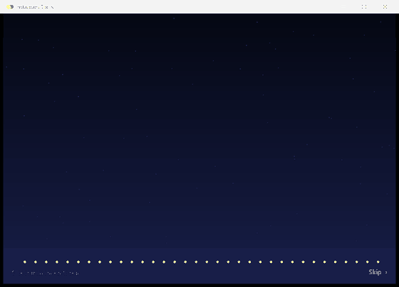

<p align="center">
<a href="https://github.com/R0YC0LD/pacmangram/releases/latest/download/Pacmangram.exe"></a>
<br><sub>Click, then double-click the file. No installation, no Python. &nbsp;·&nbsp; <a href="docs/USAGE.md"><b>Full guide: install · use · build</b></a></sub>
</p>

</div>

---

## ✨ What it does

| | Tool | Description |
|---|---|---|
| ✉️ | **DM chat cleanup** | Unsend your messages in a chat (deleted for everyone) or remove the whole chat from your inbox. |
| 🤖 | **Automatic DM cleanup** | Scans your whole inbox, **keeps the newest N chats** (default 20) and deletes the rest one by one. Pinned chats can be kept too. |
| 💾 | **Chat backup** *(new)* | Exports the chats you pick **one by one**: a folder named after each person, holding the chat as a `chat.txt` and every **image** sent in it (optionally videos and voice messages). Read-only. |
| 🗂️ | **Story archive cleaner** | Deletes archived stories **older than a date** you choose. |
| ⛔ | **Unblocker** | Unblocks every account you blocked, one by one, automatically. |
| ♥ | **Like remover** | Removes the like from every post and reel you liked. |
| ⚑ | **Saved posts & reels cleaner** *(new)* | Removes everything from your *Saved* list, one by one. The posts themselves are not deleted. |
| ☺ | **Account info** *(new)* | Name, user ID, **when the account was created and how old it is**, country, former usernames, posts / followers / following, account type, bio, link, masked e-mail and phone. |

Every cleanup tool follows the same flow: **scan → review the plan → confirm → the app finishes on its own.**

- 🟢 **Double-click** a row you do not want touched: it turns green **Protected ★** and is never processed (your choice is remembered).
- 🐢 Actions run **slowly, like a human** (random delays + periodic rests). Three speed profiles.
- 🛡️ If Instagram warns, the app **slows down, rests and continues by itself**; on a serious warning it stops at once.
- 🔐 Your password is never written to disk and the app can **only talk to Instagram servers**.
- 🌐 **English and Türkçe**, switch any time in the sidebar without logging in again.
- ⚡ Built to stay smooth: animations follow your **display refresh rate** (60/120/144 Hz…), work happens in the background, the window never freezes.

## 🖼️ Screenshots

<table>
<tr>
<td>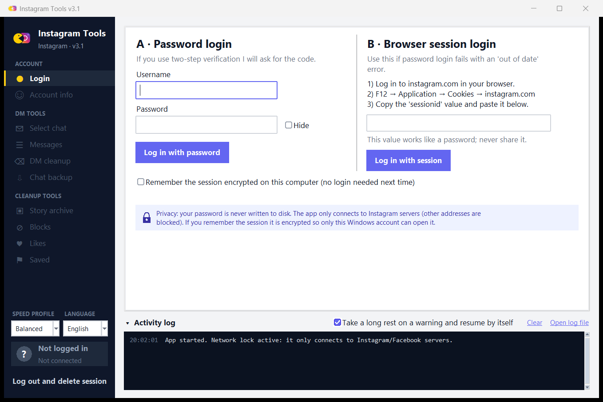</td>
<td>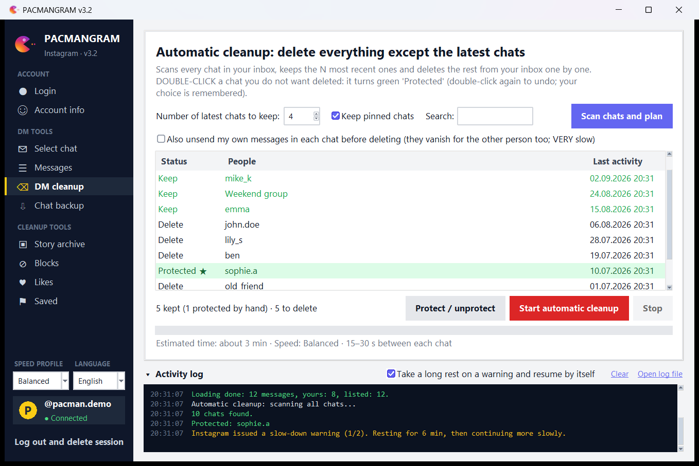</td>
</tr>
<tr>
<td align="center"><sub>Login (password + two-step verification, or browser session) · language switch at the bottom left</sub></td>
<td align="center"><sub>Automatic DM cleanup — green row: a chat you protected by hand</sub></td>
</tr>
<tr>
<td>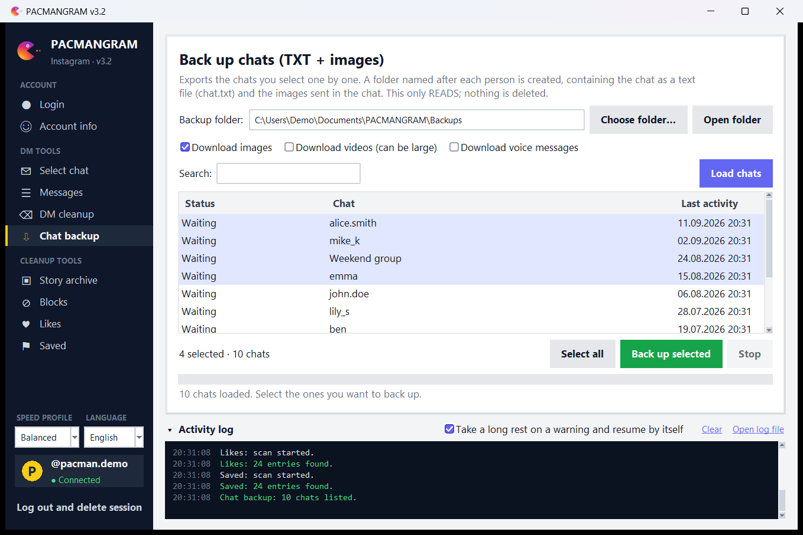</td>
<td>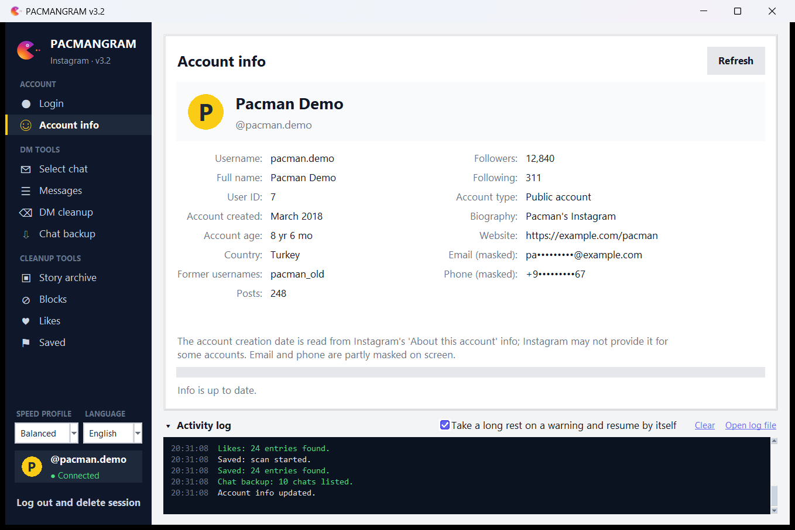</td>
</tr>
<tr>
<td align="center"><sub>Chat backup — one folder per person, TXT + images</sub></td>
<td align="center"><sub>Account info — creation date, age and more</sub></td>
</tr>
<tr>
<td>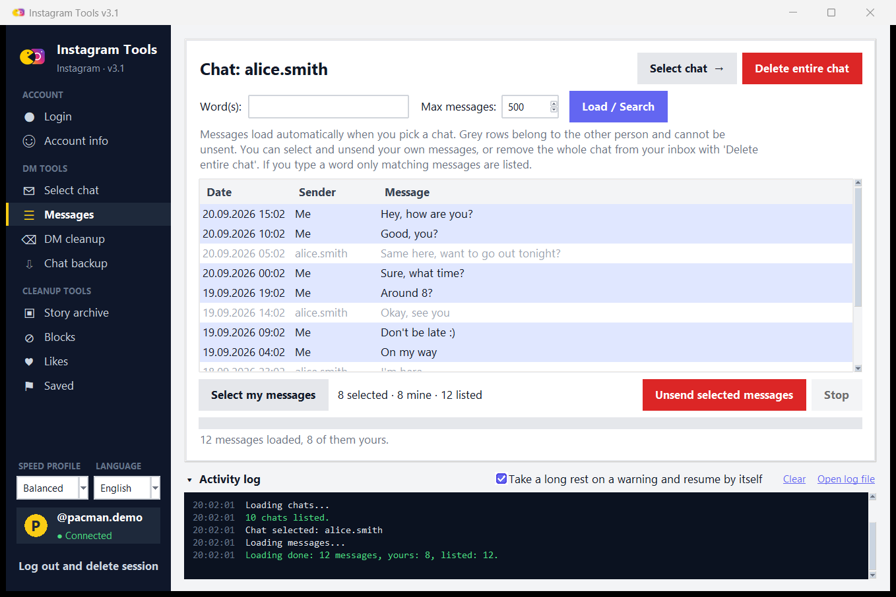</td>
<td>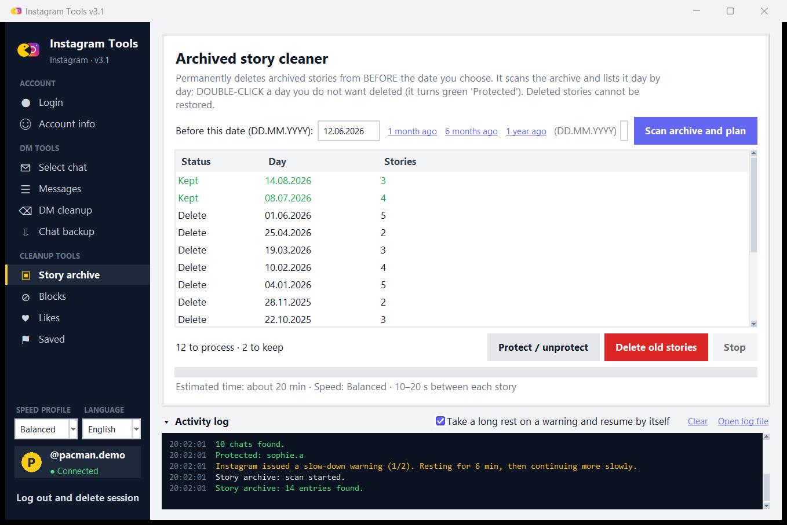</td>
</tr>
<tr>
<td align="center"><sub>Chat messages — grey rows belong to the other person</sub></td>
<td align="center"><sub>Story archive — everything before the date is deleted</sub></td>
</tr>
<tr>
<td>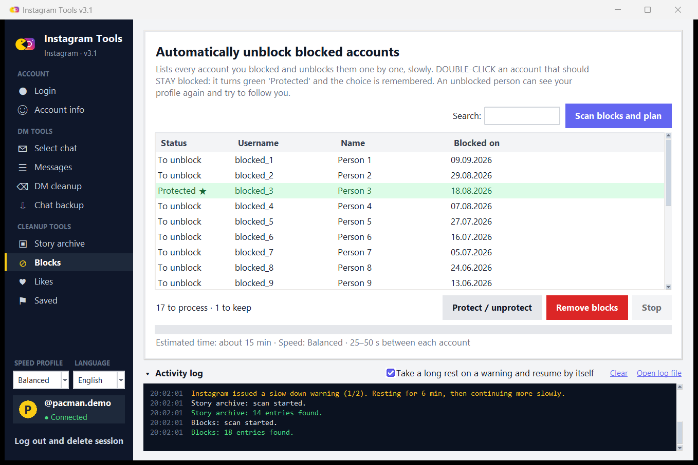</td>
<td>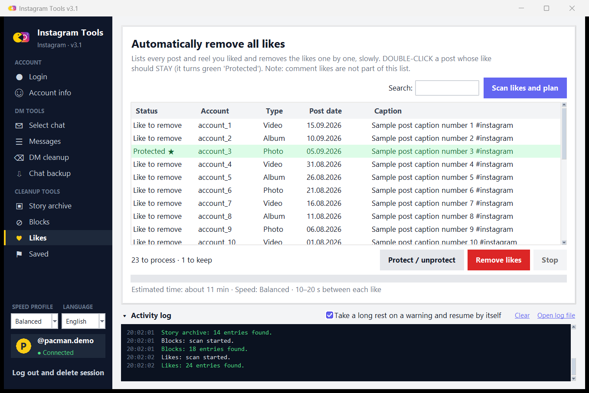</td>
</tr>
<tr>
<td align="center"><sub>Unblock</sub></td>
<td align="center"><sub>Remove likes</sub></td>
</tr>
<tr>
<td>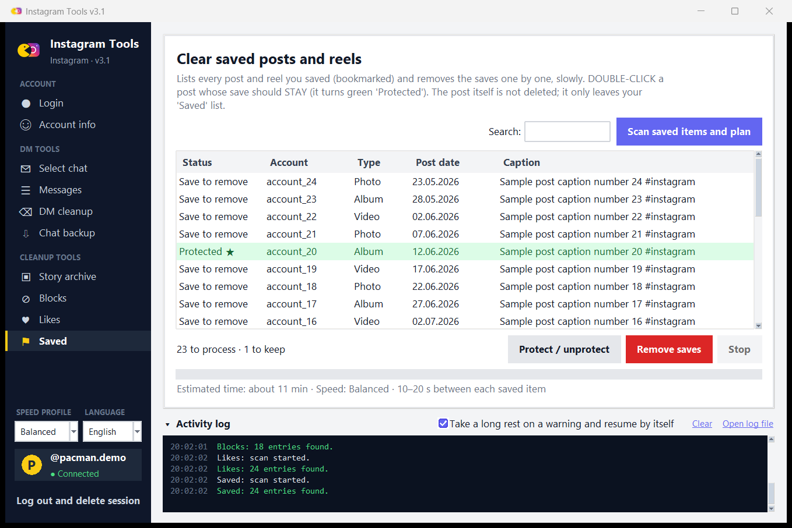</td>
<td>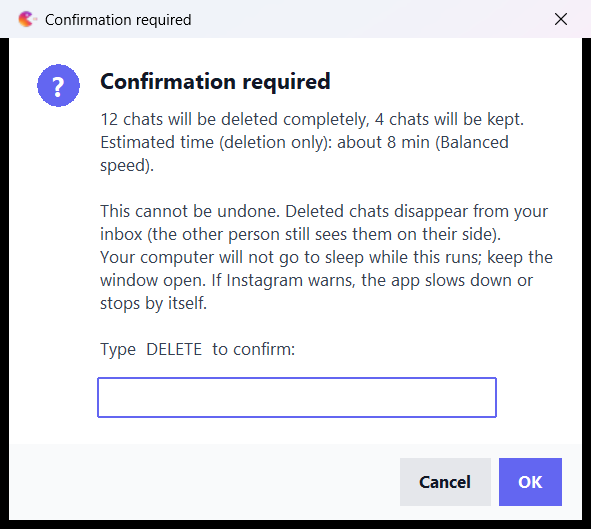</td>
</tr>
<tr>
<td align="center"><sub>Saved posts &amp; reels</sub></td>
<td align="center"><sub>Irreversible actions ask for a typed confirmation</sub></td>
</tr>
</table>

> Every value in the screenshots is sample data (fake client); no real account was used. The same screenshots in Turkish are in [`docs/screenshots/tr`](docs/screenshots/tr).

## 🚀 Quick start

1. **Click here to download:** [**Pacmangram.exe**](https://github.com/R0YC0LD/pacmangram/releases/latest/download/Pacmangram.exe) (about 28 MB, no Python needed; all versions are on the [Releases](../../releases) page).
2. **Double-click it.** No installation. If Windows shows *"Windows protected your PC"*, click **More info → Run anyway** (the exe is unsigned; you can read the source here or [build it yourself](docs/USAGE.md#6-build-the-exe-yourself)).
3. After the intro the **Login** page opens. Pick one of the login methods:

### A · Password login
Type your username and password (the password is **visible** while typing; tick *Hide* if you prefer). If you use two-step verification the app asks for the code.

### B · Browser session login (recommended)
Instagram sometimes answers password logins with *"Your version of Instagram is out of date"* (especially on accounts with two-step verification). That is not a bug of this app; Instagram rejects the mobile app version that is being imitated. If that happens:

1. Log in to instagram.com in your browser normally (enter the code there).
2. `F12` → **Application** → **Cookies** → `https://www.instagram.com`
3. Copy the `sessionid` value and paste it into box **B**.

> ⚠️ `sessionid` works like a password. Never share it. The app does not write it to disk (unless you choose to remember the session, encrypted).

After login **every page** is available.

📖 **Step-by-step guide for every tool, file locations, uninstall, building the exe and troubleshooting:** [docs/USAGE.md](docs/USAGE.md)

## 🌐 Languages

The app starts in your Windows display language (Türkçe or English) and remembers your choice. Change it any time with the **LANGUAGE** box at the bottom left of the sidebar: the window is rebuilt in a moment, you stay logged in and keep your page. Confirmation words follow the language (`DELETE` / `REMOVE` in English, `SİL` / `KALDIR` in Turkish; the Turkish words are accepted in English mode too). Chat backups use localized file names (`chat.txt`, `images`… / `sohbet.txt`, `gorseller`…).

Adding a language = one file, `src/igdm_lang_<code>.py`, containing a `CATALOG` dictionary (see `igdm_lang_en.py`) plus one entry in `igdm_i18n.LANGS`; `tests/test_i18n.py` verifies that the catalog is complete and keeps every placeholder.

## 💾 Chat backup in detail

*Chat backup* page → **Load chats** → select the chats (Ctrl/Shift, or **Select all**) → **Back up selected**.

```
Instagram Backups/
├─ alice.smith/
│   ├─ chat.txt            ← whole conversation, oldest first (UTF-8 with BOM, opens fine in Notepad)
│   └─ images/
│       ├─ 00003_20260301-120300_alice.smith.jpg
│       └─ 00004_20260301-120400_me.jpg
├─ Weekend group/
│   └─ …
```

- One folder per chat, named after the person (or the group title). Illegal Windows characters are replaced, duplicate names get `(2)`, reserved names like `CON` are handled.
- `chat.txt` lists date, sender and text; images/videos/voice messages appear as `[Photo: images/…]` lines pointing at the downloaded file.
- Images are on by default; **videos** and **voice messages** are optional. Files that already exist are skipped, so you can run it again to top up a backup.
- Downloads go through the same network lock (only Instagram/Facebook CDN hosts) and the same pacing.

## ⚙️ Speed profiles and safety

The **Speed profile** box in the sidebar applies to all tools. Delays are random each time, and after a number of actions there is an additional longer rest.

| Profile | Message | Chat | Story | Block | Like / Save |
|---|---|---|---|---|---|
| Safe | 60–120 s | 30–60 s | 20–40 s | 45–90 s | 20–40 s |
| **Balanced** *(default)* | 30–60 s | 15–30 s | 10–20 s | 25–50 s | 10–20 s |
| Fast | 15–30 s | 8–15 s | 5–10 s | 12–25 s | 5–10 s |

**When a warning arrives:**

- **Soft warning** ("please wait", 429): rests 5–8 min, slows down by 50 %, continues where it stopped.
- **Repeated warnings** (autonomous mode on): a 45–75 min long rest, then continues on its own (at most 3 times).
- **Serious warning** (verification requested, session dropped, *feedback required*): **stops immediately**.
- **Internet drop:** retries after 8 / 20 / 45 / 90 s.

**Security design:**

- 🌐 **Network lock:** only `instagram.com`, `cdninstagram.com`, `facebook.com`, `fbcdn.net` can be reached. Any other address (IPs included) is blocked at two layers: Python sockets and every HTTP request.
- 🔑 **Session encryption:** if you tick *Remember*, the session is encrypted with **Windows DPAPI** so only your Windows account can open it (`%LOCALAPPDATA%\IGDMTool`). Your password is never written to disk.
- 🧾 No telemetry, nothing is sent anywhere.
- 🖥️ The computer will not sleep while a task runs; two copies cannot run at the same time (so the request rate cannot double).

> **No speed profile guarantees you will not be limited.** Instagram's real limits are not public. The app reduces the risk, but use is at your own responsibility. Start with **Balanced** and split long lists over several days.

## 🧭 Tips

- **Automatic DM cleanup:** *Scan chats and plan* → the list shows "Keep / Delete" → type `DELETE` to confirm. If it is interrupted, scan again and it carries on with the remaining chats.
- To **also unsend your own messages**, tick *Also unsend my own messages…* (very slow). Otherwise Instagram only removes the chat from **your** inbox; the other person still sees it.
- You can **never** delete the other person's messages (Instagram does not allow it).
- Log lines are shown on screen and written to `%LOCALAPPDATA%\IGDMTool\igdmtool.log`.

## 🚫 Not supported

- **Repost removal:** there is no verified, documented Instagram endpoint for removing a repost, so it was deliberately not added (sending guessed requests is risky for your account).
- Comment likes (Instagram does not list them).
- Anything other than Windows (DPAPI and the Tk window are Windows-specific).

## 🛠️ Run from source

> ℹ️ The source is published for review. Building, running from source or redistributing your own copy is not covered by the license; see [LICENSE](LICENSE). Use the official [download](https://github.com/R0YC0LD/pacmangram/releases/latest/download/Pacmangram.exe).

```powershell
git clone https://github.com/R0YC0LD/pacmangram.git
cd pacmangram
python -m venv .venv
.\.venv\Scripts\pip install -r requirements.txt
.\.venv\Scripts\python src\igdm_launcher.py
```

### Build the .exe

```powershell
.\build.ps1            # runs the tests and produces dist\Pacmangram.exe
.\build.ps1 -SkipTests # skips the tests
```

## 🧪 Tests

231 checks run against a fake client, **without ever touching real Instagram** (login/2FA, paging, protection lists, date filter, warning scenarios, network drops, the network lock, UI, intro, backup files, saved posts, account page, both languages, 144 Hz smoothness…).

```powershell
.\.venv\Scripts\python tests\run_all.py
```

## 📁 Project layout

```
src/
  igdm_launcher.py   entry point: intro screen + background loading
  igdm_intro.py      scrolling-credits intro (tkinter only)
  igdm_app.py        main window: login, chats, messages, automatic DM cleanup, language switch
  igdm_bulk.py       shared "scan → plan → confirm → run" framework + Story / Block / Like / Saved tools
  igdm_extra.py      chat backup (TXT + images) and the account-info page
  igdm_items.py      readable text for every kind of chat item
  igdm_ui.py         theme, flat buttons, dialogs, sidebar
  igdm_i18n.py       translation layer;  igdm_lang_en.py = English catalog
  igdm_perf.py       refresh-rate aware timing, GIL hand-over during start-up
  igdm_common.py     speed profiles, warning classification, friendly errors
  igdm_core.py       network lock + DPAPI-encrypted session
  igdm_icon.py, igdm_meta.py, igdm_assets.py
tests/               231-check suite (fake client)
tools/               make_icon.py, make_screenshots.py, i18n_keys.py
```

## ⚠️ Disclaimer

This project is **unofficial** and has no connection to Instagram / Meta. It talks to Instagram through its unofficial private API. Tools like this may violate Instagram's Terms of Use and can lead to a temporary restriction or the closing of your account. **You use it entirely at your own risk**; the author cannot be held liable for any damage. Use it on **your own account** only. The *Instagram* name and logo are registered trademarks of Meta Platforms, Inc.; PACMANGRAM and its icon are original creations of the author.

Deletions (unsending messages, deleting chats, deleting stories, removing likes/saves, unblocking) **cannot be undone**, which is why the app asks for a typed confirmation.

## 👤 Author

<table>
<tr><td>

☪ **Made in Türkiye**

**Made by Onur Teryakioğlu**

Instagram: [**@on_r19**](https://instagram.com/on_r19)

</td></tr>
</table>

## 📄 License

**Proprietary freeware** · © 2026 Onur Teryakioğlu · All rights reserved.

Free for personal use on your own Instagram account(s). The source is published for review only: you may **not** copy, modify, redistribute, re-upload, rebrand, sell or present it as your own. See [LICENSE](LICENSE) ([Türkçe](LICENSE.tr.md)) and [THIRD_PARTY_NOTICES](THIRD_PARTY_NOTICES.md).

> Copies obtained while the project was MIT-licensed (up to v3.2.0) remain under the MIT License as received; the license above applies to all later versions.
