<div align="center">


# Instagram Araçları

**Pacman, Instagram'ı yesin.** Kendi hesabın için Windows aracı: DM, story, engel, beğeni ve kaydedilenleri yavaş, güvenli ve tamamen otonom temizler; sohbetlerini metin dosyası + görsel olarak yedekler; hesabının ne zaman açıldığını gösterir.

🌐 [English](README.md) · **Türkçe** &nbsp;—&nbsp; uygulamanın kendisi de iki dilde çalışır, sol menüden anında değiştirilir.

[](#-hızlı-başlangıç)
[](#-kaynaktan-çalıştırma)
[](LICENSE)
[](#-testler)
[](#-diller)
[](#-yapımcı)

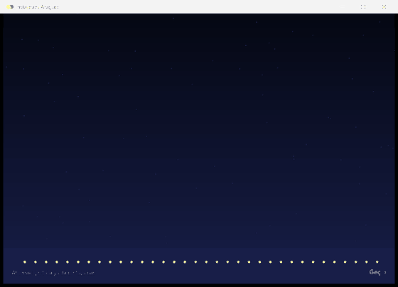

</div>

---

## ✨ Ne yapar?

| | Araç | Açıklama |
|---|---|---|
| ✉️ | **DM sohbet temizliği** | Sohbetteki mesajlarını geri çeker (herkes için siler) ya da sohbeti komple gelen kutusundan kaldırır. |
| 🤖 | **Otomatik DM temizliği** | Tüm gelen kutusunu tarar, **son N sohbeti korur** (varsayılan 20), kalanını sırayla siler. Sabitlenmiş sohbetler de korunabilir. |
| 💾 | **Sohbet yedekleme** *(yeni)* | Seçtiğin sohbetleri **tek tek** dışa aktarır: her kişi için kendi adında bir klasör; içinde sohbetin `sohbet.txt` dosyası ve sohbette gönderilen **görseller** (istersen videolar ve sesli mesajlar da). Yalnızca okur. |
| 🗂️ | **Story arşivi temizleyici** | Seçtiğin bir tarihten **önceki** arşivlenmiş storyleri siler. |
| ⛔ | **Engel kaldırıcı** | Engellediğin tüm hesapların engelini tek tek, otomatik kaldırır. |
| ♥ | **Beğeni temizleyici** | Beğendiğin tüm gönderi ve reellerin beğenisini kaldırır. |
| ⚑ | **Kaydedilen gönderi ve reel temizleyici** *(yeni)* | *Kaydedilenler* listeni tek tek boşaltır. Gönderilerin kendisi silinmez. |
| ☺ | **Hesap bilgisi** *(yeni)* | Ad, kullanıcı ID, **hesabın ne zaman açıldığı ve yaşı**, ülke, eski kullanıcı adları, gönderi / takipçi / takip sayıları, hesap türü, biyografi, bağlantı, gizlenmiş e-posta ve telefon. |

Her temizlik aracında aynı akış vardır: **tara → planı gör → onayla → program kendi başına bitirir.**

- 🟢 Dokunulmasını istemediğin bir satıra **çift tıkla**: yeşil **Korumalı ★** olur ve asla işlenmez (seçimin hatırlanır).
- 🐢 İşlemler **insan gibi yavaş** yapılır (rastgele bekleme + ara sıra dinlenme molası). Üç hız profili vardır.
- 🛡️ Instagram bir uyarı verirse program **kendiliğinden yavaşlar, dinlenir ve devam eder**; ciddi uyarıda hemen durur.
- 🔐 Şifren diske yazılmaz, program **yalnızca Instagram sunucularına** bağlanabilir.
- 🌐 **Türkçe ve English**; yeniden giriş yapmadan sol menüden anında değişir.
- ⚡ Akıcı çalışır: animasyonlar **ekran yenileme hızına** (60/120/144 Hz…) uyar, işler arka planda yapılır, pencere donmaz.

## 🖼️ Ekran görüntüleri

<table>
<tr>
<td>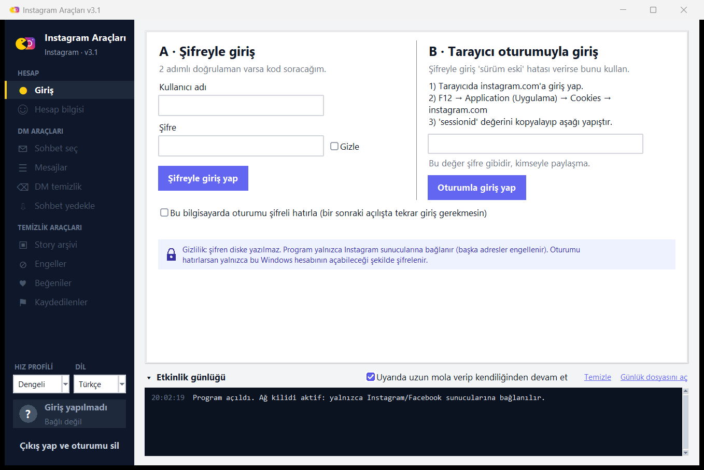</td>
<td>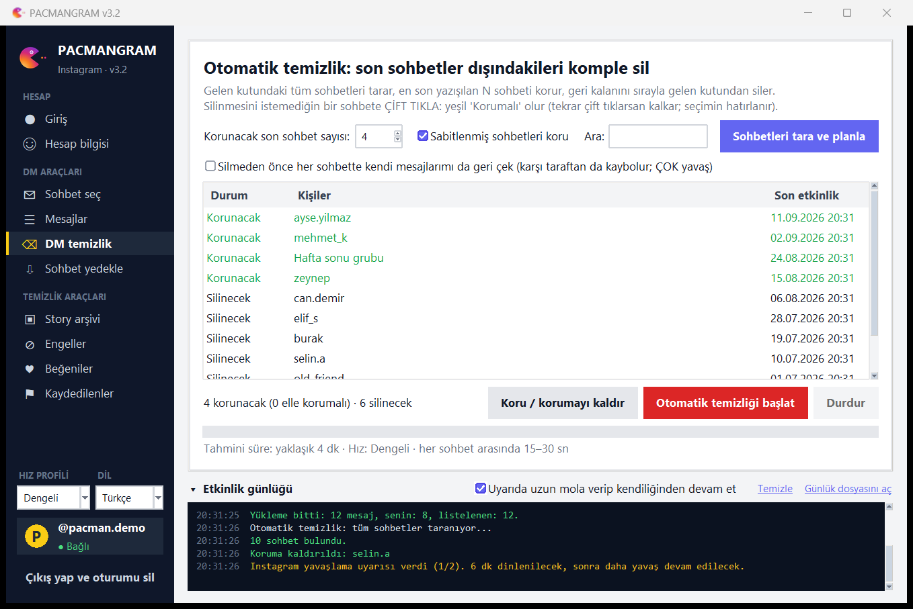</td>
</tr>
<tr>
<td align="center"><sub>Giriş (şifre + 2 adımlı doğrulama ya da tarayıcı oturumu) · sol altta dil seçimi</sub></td>
<td align="center"><sub>Otomatik DM temizliği — yeşil satır: elle korunan sohbet</sub></td>
</tr>
<tr>
<td>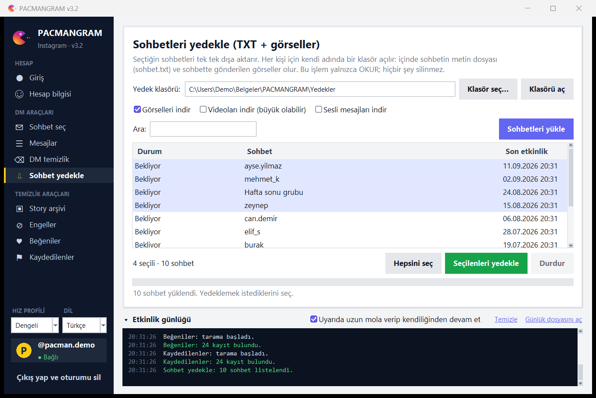</td>
<td>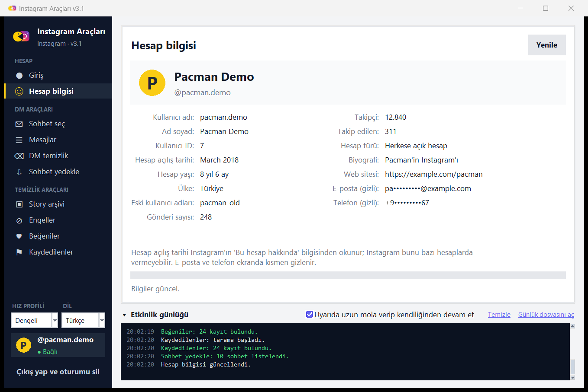</td>
</tr>
<tr>
<td align="center"><sub>Sohbet yedekleme — kişi başına klasör, TXT + görseller</sub></td>
<td align="center"><sub>Hesap bilgisi — açılış tarihi, yaş ve fazlası</sub></td>
</tr>
<tr>
<td>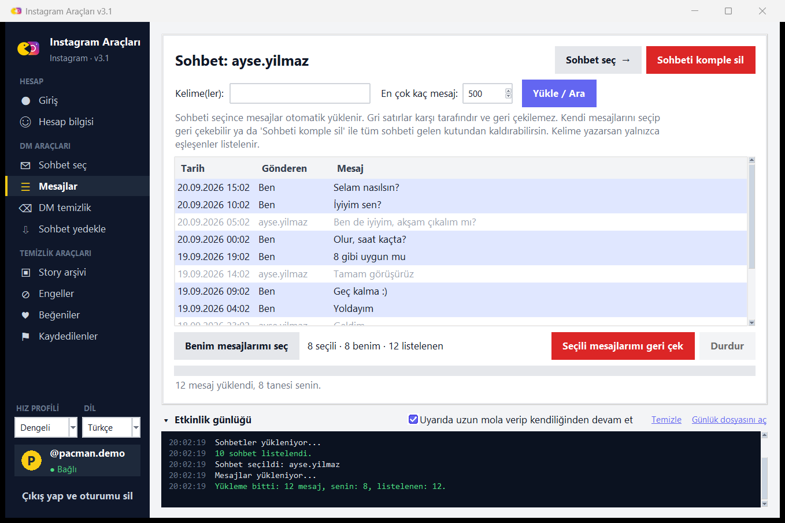</td>
<td>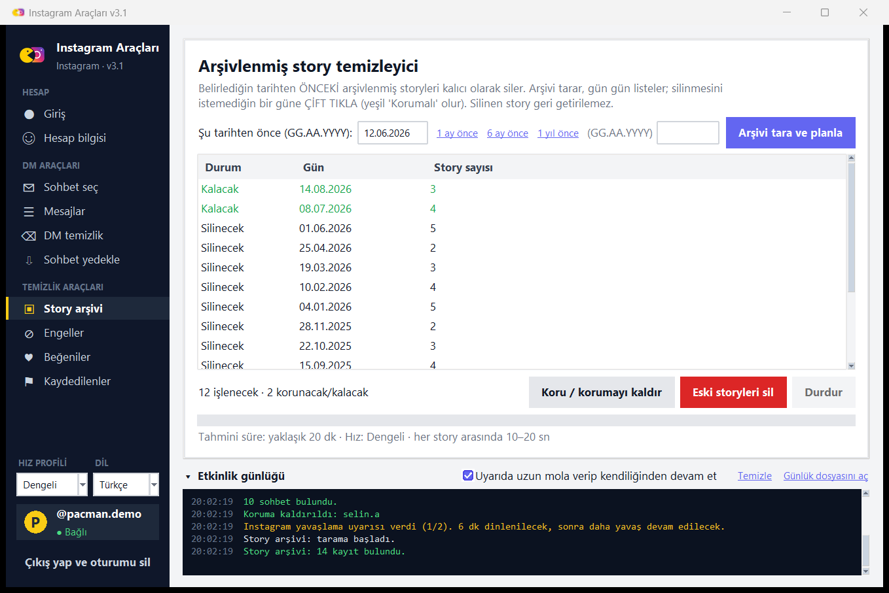</td>
</tr>
<tr>
<td align="center"><sub>Sohbet mesajları — gri satırlar karşı tarafındır</sub></td>
<td align="center"><sub>Story arşivi — tarihten öncekiler silinir</sub></td>
</tr>
<tr>
<td>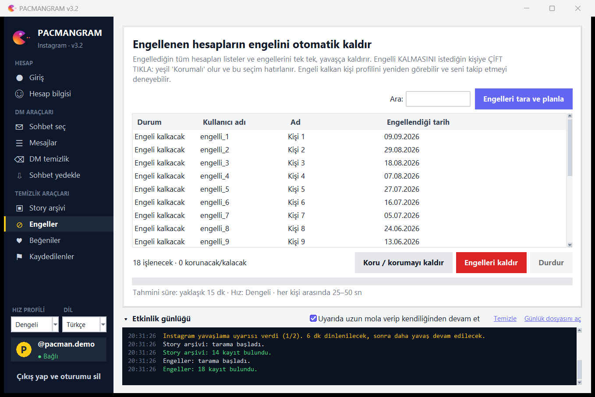</td>
<td>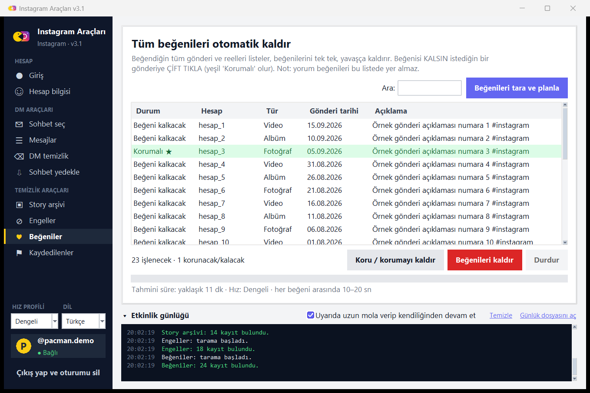</td>
</tr>
<tr>
<td align="center"><sub>Engelleri kaldır</sub></td>
<td align="center"><sub>Beğenileri kaldır</sub></td>
</tr>
<tr>
<td>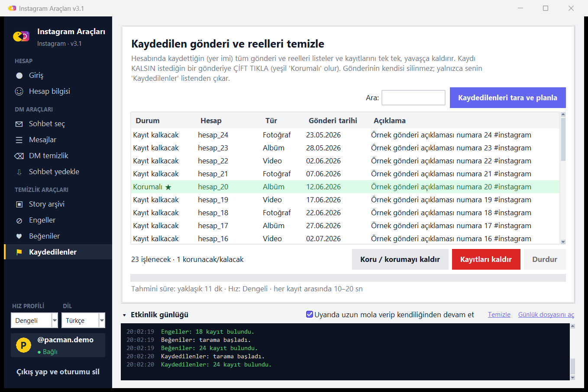</td>
<td>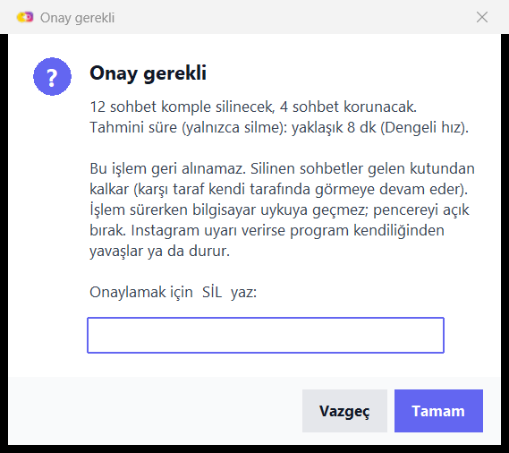</td>
</tr>
<tr>
<td align="center"><sub>Kaydedilen gönderi ve reeller</sub></td>
<td align="center"><sub>Geri alınamaz işlemler yazılı onay ister</sub></td>
</tr>
</table>

> Ekran görüntülerindeki tüm veriler örnektir (sahte istemci); gerçek bir hesap kullanılmamıştır.

## 🚀 Hızlı başlangıç

1. [**Releases**](../../releases/latest) sayfasından `InstagramTools.exe` dosyasını indir (Python gerekmez).
2. Çift tıkla. Açılış ekranından sonra **Giriş** sayfası gelir.
3. Giriş yöntemlerinden birini seç:

### A · Şifreyle giriş
Kullanıcı adı ve şifreni yaz (şifre **görünür** yazılır, istersen "Gizle"yi işaretle). 2 adımlı doğrulaman varsa program kodu sorar.

### B · Tarayıcı oturumuyla giriş (önerilir)
Instagram şifreyle girişte bazen *"Your version of Instagram is out of date"* hatası verir (özellikle 2 adımlı doğrulamalı hesaplarda). Bu, programın hatası değil; Instagram'ın taklit edilen mobil uygulama sürümünü reddetmesidir. Böyle olursa:

1. Tarayıcında instagram.com'a normal giriş yap (kodu orada gir).
2. `F12` → **Application (Uygulama)** → **Cookies** → `https://www.instagram.com`
3. `sessionid` değerini kopyala, programda **B** kutusuna yapıştır.

> ⚠️ `sessionid` bir şifre gibidir. Kimseyle paylaşma. Program onu diske yazmaz (istersen yalnızca şifreli olarak saklar).

Girişten sonra **tüm sayfalar** kullanılabilir.

## 🌐 Diller

Program Windows'un görüntüleme diliyle (Türkçe ya da English) açılır ve seçimini hatırlar. Sol menünün altındaki **DİL** kutusuyla istediğin an değiştirebilirsin: pencere bir anda yeniden kurulur, giriş yaptığın hesap ve bulunduğun sayfa korunur. Onay kelimeleri dile uyar (Türkçede `SİL` / `KALDIR`, İngilizcede `DELETE` / `REMOVE`; Türkçe kelimeler İngilizce modda da kabul edilir). Sohbet yedeklerindeki dosya adları da dile göre olur (`sohbet.txt`, `gorseller`… / `chat.txt`, `images`…).

Yeni dil eklemek = tek dosya: `src/igdm_lang_<kod>.py` içinde bir `CATALOG` sözlüğü (bkz. `igdm_lang_en.py`) ve `igdm_i18n.LANGS` içinde bir satır; `tests/test_i18n.py` sözlüğün eksiksiz olduğunu ve her `{n}` yer tutucusunun korunduğunu doğrular.

## 💾 Sohbet yedekleme ayrıntıları

*Sohbet yedekle* sayfası → **Sohbetleri yükle** → sohbetleri seç (Ctrl/Shift ya da **Hepsini seç**) → **Seçilenleri yedekle**.

```
Instagram Yedekleri/
├─ ayse.yilmaz/
│   ├─ sohbet.txt          ← tüm konuşma, eskiden yeniye (UTF-8 BOM'lu, Not Defteri'nde düzgün açılır)
│   └─ gorseller/
│       ├─ 00003_20260301-120300_ayse.yilmaz.jpg
│       └─ 00004_20260301-120400_ben.jpg
├─ Hafta sonu grubu/
│   └─ …
```

- Her sohbet için kişinin (ya da grup başlığının) adında bir klasör açılır. Windows'ta yasak karakterler değiştirilir, aynı isimler `(2)` alır, `CON` gibi ayrılmış adlar sorun çıkarmaz.
- `sohbet.txt` tarih, gönderen ve metni listeler; görsel/video/sesli mesajlar indirilen dosyayı gösteren `[Fotoğraf: gorseller/…]` satırları olarak yer alır.
- Görseller varsayılan olarak açıktır; **video** ve **sesli mesaj** isteğe bağlıdır. Var olan dosyalar atlanır; yedeği tamamlamak için yeniden çalıştırabilirsin.
- İndirmeler de aynı ağ kilidinden (yalnızca Instagram/Facebook CDN adresleri) ve aynı yavaşlatmadan geçer.

## ⚙️ Hız profilleri ve güvenlik önlemleri

Sol alttaki **Hız profili** tüm araçlar için geçerlidir. Süreler her seferinde rastgeledir; belirli sayıda işlemden sonra ayrıca uzun bir mola verilir.

| Profil | Mesaj | Sohbet | Story | Engel | Beğeni / Kayıt |
|---|---|---|---|---|---|
| Güvenli | 60–120 sn | 30–60 sn | 20–40 sn | 45–90 sn | 20–40 sn |
| **Dengeli** *(varsayılan)* | 30–60 sn | 15–30 sn | 10–20 sn | 25–50 sn | 10–20 sn |
| Hızlı | 15–30 sn | 8–15 sn | 5–10 sn | 12–25 sn | 5–10 sn |

**Uyarı geldiğinde:**

- **Yumuşak uyarı** ("lütfen bekle", 429): 5–8 dk dinlenir, hızı %50 yavaşlatır, kaldığı yerden devam eder.
- **Uyarılar üst üste gelirse** (otonom mod açıksa): 45–75 dk uzun mola verip kendiliğinden devam eder (en çok 3 kez).
- **Ciddi uyarı** (doğrulama isteme, oturum düşmesi, *feedback required*): **hemen durur**.
- **İnternet kopması:** 8 / 20 / 45 / 90 sn aralıklarla yeniden dener.

**Güvenlik tasarımı:**

- 🌐 **Ağ kilidi:** yalnızca `instagram.com`, `cdninstagram.com`, `facebook.com`, `fbcdn.net` adreslerine bağlanılabilir. Başka her adres (IP dahil) engellenir; iki katmanda: Python soketleri ve her HTTP isteği.
- 🔑 **Oturum şifrelemesi:** "Hatırla" seçersen oturum **Windows DPAPI** ile yalnızca senin Windows hesabının açabileceği şekilde şifrelenir (`%LOCALAPPDATA%\IGDMTool`). Şifren hiçbir zaman diske yazılmaz.
- 🧾 Program hiçbir telemetri toplamaz ve hiçbir yere veri göndermez.
- 🖥️ İşlem sürerken bilgisayar uykuya geçmez; iki kopya aynı anda çalışamaz (istek hızı katlanmasın diye).

> **Hiçbir hız profili "ceza yemezsin" garantisi vermez.** Instagram'ın gerçek limitleri açık değildir. Program riski azaltır, ama kullanım senin sorumluluğundadır. İlk seferde **Dengeli** ile başla, uzun listeleri birkaç güne böl.

## 🧭 Kullanım ipuçları

- **Otomatik DM temizliği:** *Sohbetleri tara ve planla* → liste "Korunacak / Silinecek" olarak gelir → `SİL` yazıp onayla. Yarıda kalırsa yeniden tara, kalan sohbetlerden devam eder.
- **Kendi mesajlarını da geri çekmek** için "Silmeden önce mesajlarımı da geri çek" kutusunu işaretle (çok yavaştır). Yoksa Instagram yalnızca **senin** gelen kutundan siler; karşı taraf sohbeti görmeye devam eder.
- Karşı tarafın mesajlarını **hiçbir yöntemle** silemezsin (Instagram izin vermez).
- Onay kelimeleri Türkçe klavyeyle sorunsuz çalışır: `SİL`, `sil`, `SIL`, `KALDIR`…
- Etkinlik günlüğü hem ekranda hem `%LOCALAPPDATA%\IGDMTool\igdmtool.log` dosyasında tutulur.

## 🚫 Desteklenmeyenler

- **Repost temizleme:** Instagram'ın repost'u kaldırma isteği için doğrulanmış, belgelenmiş bir uç nokta bulunmadığından bilerek eklenmedi (tahminle istek göndermek hesap için risklidir).
- Yorum beğenileri (Instagram bunları listelemiyor).
- Windows dışındaki sistemler (DPAPI ve Tk penceresi Windows'a özeldir).

## 🛠️ Kaynaktan çalıştırma

```powershell
git clone https://github.com/R0YC0LD/instagram-tools.git
cd instagram-tools
python -m venv .venv
.\.venv\Scripts\pip install -r requirements.txt
.\.venv\Scripts\python src\igdm_launcher.py
```

### .exe derleme

```powershell
.\build.ps1            # testleri çalıştırır ve dist\InstagramTools.exe üretir
.\build.ps1 -SkipTests # testleri atlar
```

## 🧪 Testler

Gerçek Instagram'a **hiç bağlanmadan**, sahte bir istemciyle 231 kontrol çalışır (giriş/2FA, sayfalama, koruma listeleri, tarih filtresi, uyarı senaryoları, ağ kopması, ağ kilidi, arayüz, açılış ekranı, yedek dosyaları, kaydedilenler, hesap sayfası, iki dil, 144 Hz akıcılığı…).

```powershell
.\.venv\Scripts\python tests\run_all.py
```

## 📁 Proje yapısı

```
src/
  igdm_launcher.py   giriş noktası: açılış ekranı + arka planda yükleme
  igdm_intro.py      kayan credits açılış ekranı (yalnızca tkinter)
  igdm_app.py        ana pencere: giriş, sohbetler, mesajlar, otomatik DM temizliği, dil değiştirme
  igdm_bulk.py       ortak "tara → planla → onayla → çalıştır" iskeleti + Story / Engel / Beğeni / Kaydedilen araçları
  igdm_extra.py      sohbet yedekleme (TXT + görseller) ve hesap bilgisi sayfası
  igdm_items.py      her tür sohbet öğesi için okunur metin
  igdm_ui.py         tema, düz düğmeler, diyaloglar, yan menü
  igdm_i18n.py       çeviri katmanı;  igdm_lang_en.py = İngilizce sözlük
  igdm_perf.py       ekran yenileme hızına duyarlı zamanlama, açılışta GIL devri
  igdm_common.py     hız profilleri, uyarı sınıflandırması, anlaşılır hata metinleri
  igdm_core.py       ağ kilidi + DPAPI ile şifreli oturum
  igdm_icon.py, igdm_meta.py, igdm_assets.py
tests/               231 kontrollük test paketi (sahte istemci)
tools/               make_icon.py, make_screenshots.py, i18n_keys.py
```

## ⚠️ Sorumluluk reddi

Bu proje **resmî değildir**; Instagram / Meta ile hiçbir bağlantısı yoktur. Instagram'la, resmî olmayan (özel) API'si üzerinden konuşur. Bu tür araçlar Instagram'ın Kullanım Şartları'na aykırı olabilir ve hesabın geçici kısıtlanmasına ya da kapatılmasına yol açabilir. **Kullanım tamamen kendi sorumluluğundadır**; yazar hiçbir zarardan sorumlu tutulamaz. Yalnızca **kendi hesabında** kullan. *Instagram* adı ve logosu Meta Platforms, Inc.'in tescilli markasıdır; uygulama ikonu bu proje için sıfırdan çizilmiş bir çizimdir.

Silme işlemleri (mesaj geri çekme, sohbet silme, story silme, beğeni/kayıt kaldırma, engel kaldırma) **geri alınamaz**. Program bu yüzden yazılı onay ister.

## 👤 Yapımcı

<table>
<tr><td>

☪ **Made in Türkiye**

**Made by Onur Teryakioğlu**

Instagram: [**@on_r19**](https://instagram.com/on_r19)

</td></tr>
</table>

## 📄 Lisans

[MIT](LICENSE) © 2026 Onur Teryakioğlu
